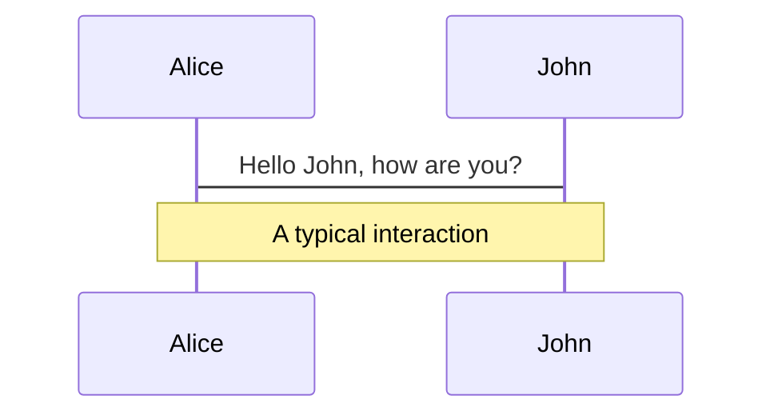
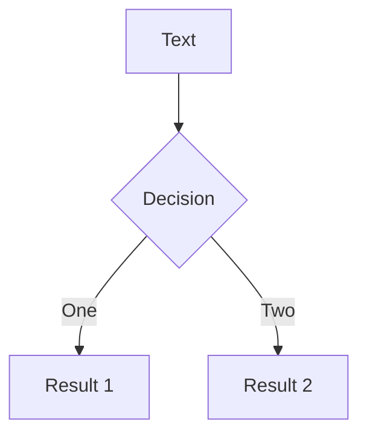
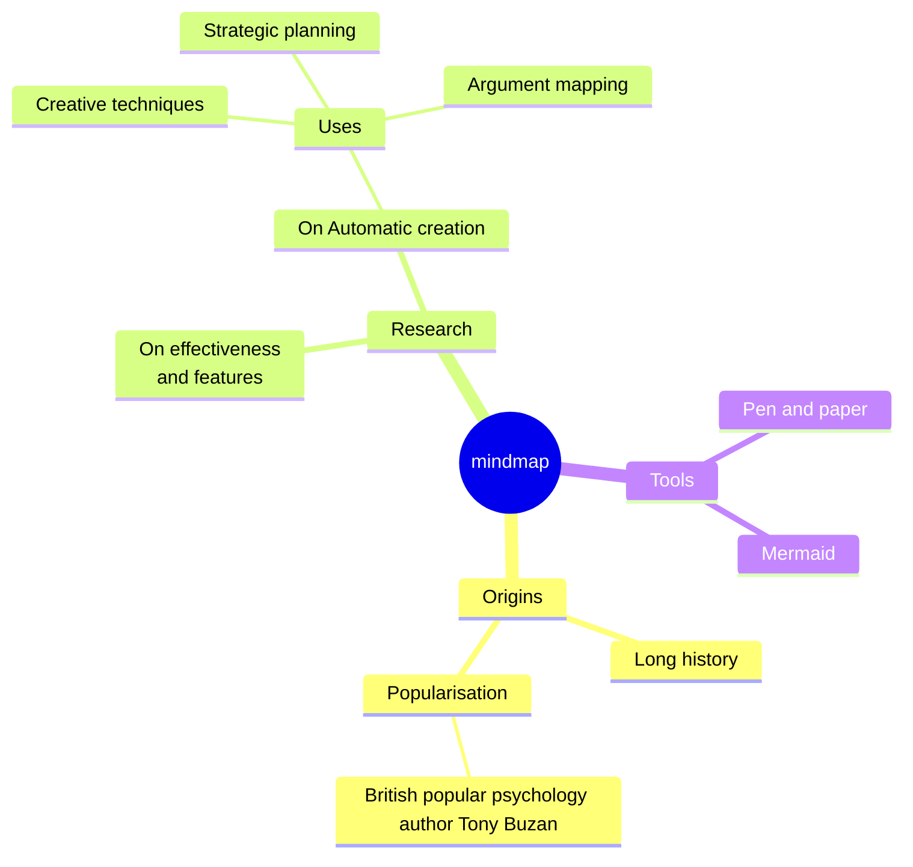
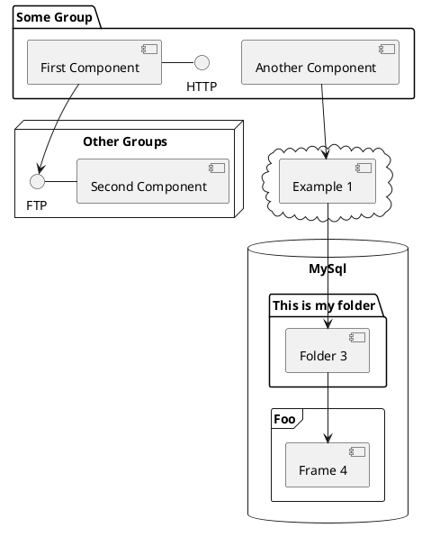

<script setup>
console.log('=== SLIDES.MD DEBUGGING ===');
console.log('Current URL:', window.location.href);
console.log('Search params:', window.location.search);
console.log('Hash:', window.location.hash);

// Check if we're in embed mode
const isEmbedMode = window.location.search.includes('embed=true');
console.log('Is embed mode detected:', isEmbedMode);

// Disable navigation in embed mode
if (isEmbedMode) {
  console.log('=== EMBED MODE ACTIVATED ===');
  
  // Set data attribute for CSS targeting
  document.documentElement.setAttribute('data-embed', 'true');
  console.log('Data-embed attribute set to true');
  
  // Wait for Slidev to be ready before overriding navigation
  const waitForSlidev = () => {
    console.log('Checking if Slidev is ready...');
    console.log('$slidev exists:', typeof $slidev !== 'undefined');
    if (typeof $slidev !== 'undefined') {
      console.log('$slidev.nav exists:', !!$slidev.nav);
    }
    
    if (typeof $slidev !== 'undefined' && $slidev.nav) {
      console.log('Slidev is ready, overriding navigation...');
      
      // Override navigation methods
      $slidev.nav.next = () => {
        console.log('Navigation disabled in embed mode - next() called');
        return false;
      };
      
      $slidev.nav.prev = () => {
        console.log('Navigation disabled in embed mode - prev() called');
        return false;
      };
      
      // Also override keyboard navigation
      const originalKeydown = document.onkeydown;
      document.onkeydown = (e) => {
        if (e.key === 'ArrowRight' || e.key === 'ArrowLeft' || e.key === ' ' || e.key === 'Enter') {
          console.log('Keyboard navigation blocked:', e.key);
          e.preventDefault();
          e.stopPropagation();
          return false;
        }
        if (originalKeydown) return originalKeydown(e);
      };
      
      console.log('Embed mode: Navigation disabled successfully');
    } else {
      console.log('Slidev not ready yet, retrying in 100ms...');
      // Try again in a moment
      setTimeout(waitForSlidev, 100);
    }
  };
  
  // Start waiting for Slidev
  waitForSlidev();
  
  // Hide navigation elements
  const hideNavElements = () => {
    console.log('Hiding navigation elements...');
    const navElements = document.querySelectorAll('.slidev-nav, .slidev-nav-button, [data-slidev-nav], .abs-br, .slidev-icon-btn, .slidev-nav-bar, .slidev-controls');
    console.log('Found nav elements:', navElements.length);
    navElements.forEach((el, index) => {
      if (el) {
        console.log(`Hiding nav element ${index}:`, el.className);
        el.style.display = 'none';
        el.style.visibility = 'hidden';
      }
    });
    
    // Also hide clickable navigation elements
    const clickableNavs = document.querySelectorAll('div[onclick*="nav"], button[onclick*="nav"], [data-slidev-click]');
    console.log('Found clickable nav elements:', clickableNavs.length);
    clickableNavs.forEach((el, index) => {
      if (el) {
        console.log(`Hiding clickable nav element ${index}:`, el.className);
        el.style.display = 'none';
        el.style.pointerEvents = 'none';
      }
    });
  };
  
  // Hide elements immediately and also after DOM is ready
  hideNavElements();
  document.addEventListener('DOMContentLoaded', () => {
    console.log('DOM loaded, hiding nav elements again...');
    hideNavElements();
  });
  
  // Also hide elements periodically to catch any that load later
  setInterval(() => {
    console.log('Periodic nav element cleanup...');
    hideNavElements();
  }, 1000);
} else {
  console.log('Not in embed mode, navigation will work normally');
}
</script>

<style>
@import './style.css';
</style>

# Vision
## Creating Direction for Your Family

<!--
The last comment block of each slide will be treated as slide notes. It will be visible and editable in Presenter Mode along with the slide. [Read more in the docs](https://sli.dev/guide/syntax.html#notes)
-->

---

# Your family is like a boat
## Without direction, the storm decides where you end up

<!-- The boat metaphor introduces the importance of having direction during difficult times -->

---

# When divorce hits:
- Kids are shuffled between households
- Routines fall apart
- Parents react instead of lead
- Everyone goes into survival mode

<!-- Divorce creates chaos that affects every aspect of family life -->

---

# "If you don't steer your family on purpose—the storm will decide where you end up."

<!-- This is the core message about taking intentional control -->

---

# Without a vision, everything drifts:
- Schedules
- Communication  
- Relationships
- Your identity

<!-- The consequences of not having intentional direction -->

---

# "You don't need to be perfect. But it can change your kid's lives if you are intentional."

<!-- Encouragement that intentionality matters more than perfection -->

---

# It's not too late to take the wheel

## This module will help you:
- Define your family's values
- Identify your strengths  
- Anchor your kids

<!-- Hope and preview of what's coming in the module -->

---

# Creating a family vision isn't optional—it's a critical intervention that protects your children's emotional lives

<!-- Transitioning to the research-backed importance of family vision -->

---

# Children with intentional family vision:
- 40% better academic performance
- Significantly lower behavioral problems
- Remarkable resilience

## It's about intentional leadership, not perfection

<!-- Specific benefits backed by research -->

---

# Family vision is biological:
- Chaos activates chronic stress response
- Consistency develops stronger brain function
- Better emotional regulation
- Improved executive functioning

<!-- The neurological impact of family vision -->

---

# "An intentional family vision acts as a protective buffer against toxic stress"

<!-- Key research finding about protection from stress -->

---

# Without family vision, children risk "identity diffusion":
- Loss of sense of self
- Loss of belonging
- Long-term effects into adulthood

<!-- The risks of not having intentional family structure -->

---

# Intentional family vision gives children:
- A stable narrative of their family story
- Greater security in relationships
- Better emotional coping strategies

<!-- The positive outcomes of having family vision -->

---

# Co-parenting quality is the #1 predictor of child adjustment after divorce

<!-- The critical importance of co-parenting relationship -->

---

# Consistent family routines lead to:
- 65% reduction in severe anxiety
- Dramatic decrease in sleep disorders
- Reduction in abnormal fears
- Better emotional regulation

<!-- Specific research outcomes for consistent routines -->

---

# Children with strong family vision are:
- 3x more likely to feel secure in family relationships
- 2x more likely to have healthy adult relationships
- More likely to develop effective coping strategies

<!-- Long-term benefits for children -->

---

# Good co-parenting reduces negative effects of divorce by 25-60%

<!-- Quantified benefit of good co-parenting -->

---

# Early investment in family vision creates protective effects that last throughout your child's development

<!-- The lasting impact of early intervention -->

---

# Time-sensitive opportunity:
## The window for intervention narrows quickly
## More than 2 years of chaos = increasingly resistant dysfunction patterns

<!-- Urgency of taking action -->

---

# 46% of children from high-conflict divorces are at increased risk for PTSD

<!-- Stark statistic about high-conflict divorce impact -->

---

# "A respectful, amicable divorce is often better for children's well-being and models healthy, mature ways to handle conflict"

<!-- Research supporting amicable divorce approach -->

---

# Your family vision is a lighthouse:
- Provides consistent guidance
- Reduces uncertainty about the future
- Provides emotional safety during transitions
- Maintains attachments with both parents

<!-- Metaphor for how vision functions -->

---

# Your vision becomes their anchor:
## The structure changed, but the core strength and love remain intact

<!-- Reassurance about continuity despite change -->

---

# Creating an intentional family vision isn't optional—it's essential for protecting your children's future

<!-- Transition to practical application -->

---

# It's never going to feel convenient
## Investing the time and effort now will save so much more down the road

<!-- Encouragement to act despite inconvenience -->

---

# You have the power to completely change your children's trajectory

## You're protecting:
- Their future adult relationships
- Their mental health  
- Their ability to create healthy families

<!-- Empowerment and long-term perspective -->

---

# Guiding values act like a compass:
## Helping you move forward with clarity, even when you don't have a map

<!-- Introduction to values work -->

---

# Reflection Questions:
- Who do you want to be in this next chapter?
- What matters most to you, even on the hard days?
- What legacy do you want to leave as a parent?

<!-- Self-reflection prompts -->

---

# Why Values Matter:
- Help you respond with intention vs. react impulsively
- Kids watch how you live, not just what you say
- Help you avoid parenting from guilt, anger, or fear

<!-- Benefits of having clear values -->

---

# Reflection Questions:
- Values I want to pass on to my children?
- Values I don't want to repeat?
- What value am I living out when I feel proud of my parenting?
- What value might I be missing when I feel disconnected?
- What values do I hope my children carry into adulthood?

<!-- Deeper reflection prompts for values identification -->

---

# Choose 5 Core Values
## Your personal compass for when:
- Emotions are high
- Decisions are hard
- You're feeling discouraged

<!-- Instructions for selecting core values -->

---

# Define Your Values:
**Kindness** = I pause before I speak and look for ways to build others up

**Courage** = I do the hard things even when I feel afraid

**Grace** = I give second chances—to my kids, their other parent, and myself

<!-- Examples of how to define values -->

---

# Keep your values visible—otherwise they're as helpful as a flashlight with no batteries

<!-- Importance of making values accessible -->

---

# "You don't have to get every moment right. But parenting from your values gives your children a consistent, grounded, thoughtful parent"

<!-- Encouragement about imperfect but values-based parenting -->

---

# Your family vision becomes the north star that guides you through day-to-day challenges

<!-- Introduction to family culture and norms -->

---

# It takes time to adjust to new ways of life
## Your consistency will eventually pull your kids into alignment

<!-- Setting expectations about change process -->

---

# There are no shortcuts when it comes to relationships

<!-- Reality check about the work required -->

---

# Intentional routines give your kids the best chance possible

<!-- Encouragement about the value of routines -->

---

# Not a checklist—a menu of options you can choose from and adapt

<!-- Framing for the practical suggestions -->

---

# Daily Micro-Routines (2-10 minutes):
- Evening Walk & Check-In
- High/Low at Dinner or Bedtime
- 5-Minute Reconnect Rule
- "Three Things" Bedtime Tradition
- Before-School Hug & Pep Talk

<!-- Practical daily routine suggestions -->

---

# Weekly Rituals:
- Friday Night Movie/Board Game Night
- Saturday Morning Pancake Breakfast  
- Wednesday Walk & Talk
- Sunday Night Planning Chat
- One-on-One Parent-Child Time

<!-- Weekly routine suggestions -->

---

# Monthly Family Markers:
- "New Tradition Night"
- Family Gratitude Jar
- Photo Memory Night

## (Acknowledges the past while building the future)

<!-- Monthly routine suggestions with note about honoring the past -->

---

# Give them a space where they can just be a kid—not "the kid whose parents are divorced"

<!-- Importance of identity outside the divorce story -->

---

# Help them build confidence based on who they are, not what they've been through

<!-- Focus on individual identity development -->

---

# Find other kids who just "get it"—it normalizes the experience and reduces isolation

<!-- Value of peer connections with others in similar situations -->

<!--
Notes can also sync with clicks

[click] This will be highlighted after the first click

[click] Highlighted with `count = ref(0)`

[click:3] Last click (skip two clicks)
-->

---
level: 2
---

# Shiki Magic Move

Powered by [shiki-magic-move](https://shiki-magic-move.netlify.app/), Slidev supports animations across multiple code snippets.

Add multiple code blocks and wrap them with <code>````md magic-move</code> (four backticks) to enable the magic move. For example:

````md magic-move {lines: true}
```ts {*|2|*}
// step 1
const author = reactive({
  name: 'John Doe',
  books: [
    'Vue 2 - Advanced Guide',
    'Vue 3 - Basic Guide',
    'Vue 4 - The Mystery'
  ]
})
```

```ts {*|1-2|3-4|3-4,8}
// step 2
export default {
  data() {
    return {
      author: {
        name: 'John Doe',
        books: [
          'Vue 2 - Advanced Guide',
          'Vue 3 - Basic Guide',
          'Vue 4 - The Mystery'
        ]
      }
    }
  }
}
```

```ts
// step 3
export default {
  data: () => ({
    author: {
      name: 'John Doe',
      books: [
        'Vue 2 - Advanced Guide',
        'Vue 3 - Basic Guide',
        'Vue 4 - The Mystery'
      ]
    }
  })
}
```

Non-code blocks are ignored.

```vue
<!-- step 4 -->
<script setup>
const author = {
  name: 'John Doe',
  books: [
    'Vue 2 - Advanced Guide',
    'Vue 3 - Basic Guide',
    'Vue 4 - The Mystery'
  ]
}
</script>
```
````

---

# Components

<div grid="~ cols-2 gap-4">
<div>

You can use Vue components directly inside your slides.

We have provided a few built-in components like `<Tweet/>` and `<Youtube/>` that you can use directly. And adding your custom components is also super easy.

```html
<Counter :count="10" />
```

<!-- ./components/Counter.vue -->
<Counter :count="10" m="t-4" />

Check out [the guides](https://sli.dev/builtin/components.html) for more.

</div>
<div>

```html
<Tweet id="1390115482657726468" />
```

<Tweet id="1390115482657726468" scale="0.65" />

</div>
</div>

<!--
Presenter note with **bold**, *italic*, and ~~striked~~ text.

Also, HTML elements are valid:
<div class="flex w-full">
  <span style="flex-grow: 1;">Left content</span>
  <span>Right content</span>
</div>
-->

---
class: px-20
---

# Themes

Slidev comes with powerful theming support. Themes can provide styles, layouts, components, or even configurations for tools. Switching between themes by just **one edit** in your frontmatter:

<div grid="~ cols-2 gap-2" m="t-2">

```yaml
---
theme: default
---
```

```yaml
---
theme: seriph
---
```


</div>

Read more about [How to use a theme](https://sli.dev/guide/theme-addon#use-theme) and
check out the [Awesome Themes Gallery](https://sli.dev/resources/theme-gallery).

---

# Clicks Animations

You can add `v-click` to elements to add a click animation.

<div v-click>

This shows up when you click the slide:

```html
<div v-click>This shows up when you click the slide.</div>
```

</div>

<br>

<v-click>

The <span v-mark.red="3"><code>v-mark</code> directive</span>
also allows you to add
<span v-mark.circle.orange="4">inline marks</span>
, powered by [Rough Notation](https://roughnotation.com/):

```html
<span v-mark.underline.orange>inline markers</span>
```

</v-click>

<div mt-20 v-click>

[Learn more](https://sli.dev/guide/animations#click-animation)

</div>

---

# Motions

Motion animations are powered by [@vueuse/motion](https://motion.vueuse.org/), triggered by `v-motion` directive.

```html
<div
  v-motion
  :initial="{ x: -80 }"
  :enter="{ x: 0 }"
  :click-3="{ x: 80 }"
  :leave="{ x: 1000 }"
>
  Slidev
</div>
```

<div class="w-60 relative">
  <div class="relative w-40 h-40">
    
    
    
  </div>

  <div
    class="text-5xl absolute top-14 left-40 text-[#2B90B6] -z-1"
    v-motion
    :initial="{ x: -80, opacity: 0}"
    :enter="{ x: 0, opacity: 1, transition: { delay: 2000, duration: 1000 } }">
    Slidev
  </div>
</div>

<!-- vue script setup scripts can be directly used in markdown, and will only affects current page -->
<script setup lang="ts">
const final = {
  x: 0,
  y: 0,
  rotate: 0,
  scale: 1,
  transition: {
    type: 'spring',
    damping: 10,
    stiffness: 20,
    mass: 2
  }
}
</script>

<div
  v-motion
  :initial="{ x:35, y: 30, opacity: 0}"
  :enter="{ y: 0, opacity: 1, transition: { delay: 3500 } }">

[Learn more](https://sli.dev/guide/animations.html#motion)

</div>

---

# LaTeX

LaTeX is supported out-of-box. Powered by [KaTeX](https://katex.org/).

<div h-3 />

Inline $\sqrt{3x-1}+(1+x)^2$

Block
$$ {1|3|all}
\begin{aligned}
\nabla \cdot \vec{E} &= \frac{\rho}{\varepsilon_0} \\
\nabla \cdot \vec{B} &= 0 \\
\nabla \times \vec{E} &= -\frac{\partial\vec{B}}{\partial t} \\
\nabla \times \vec{B} &= \mu_0\vec{J} + \mu_0\varepsilon_0\frac{\partial\vec{E}}{\partial t}
\end{aligned}
$$

[Learn more](https://sli.dev/features/latex)

---

# Diagrams

You can create diagrams / graphs from textual descriptions, directly in your Markdown.

<div class="grid grid-cols-4 gap-5 pt-4 -mb-6">









</div>

Learn more: [Mermaid Diagrams](https://sli.dev/features/mermaid) and [PlantUML Diagrams](https://sli.dev/features/plantuml)

---
foo: bar
dragPos:
  square: 691,32,167,_,-16
---

# Draggable Elements

Double-click on the draggable elements to edit their positions.

<br>

###### Directive Usage

```md

```

<br>

###### Component Usage

```md
<v-drag text-3xl>
  <div class="i-carbon:arrow-up" />
  Use the `v-drag` component to have a draggable container!
</v-drag>
```

<v-drag pos="663,206,261,_,-15">
  <div text-center text-3xl border border-main rounded>
    Double-click me!
  </div>
</v-drag>


###### Draggable Arrow

```md
<v-drag-arrow two-way />
```

<v-drag-arrow pos="67,452,253,46" two-way op70 />

---
src: ./pages/imported-slides.md
hide: false
---

---

# Monaco Editor

Slidev provides built-in Monaco Editor support.

Add `{monaco}` to the code block to turn it into an editor:

```ts {monaco}
import { ref } from 'vue'
import { emptyArray } from './external'

const arr = ref(emptyArray(10))
```

Use `{monaco-run}` to create an editor that can execute the code directly in the slide:

```ts {monaco-run}
import { version } from 'vue'
import { emptyArray, sayHello } from './external'

sayHello()
console.log(`vue ${version}`)
console.log(emptyArray<number>(10).reduce(fib => [...fib, fib.at(-1)! + fib.at(-2)!], [1, 1]))
```

---
layout: center
class: text-center
---

# Learn More

[Documentation](https://sli.dev) · [GitHub](https://github.com/slidevjs/slidev) · [Showcases](https://sli.dev/resources/showcases)

<PoweredBySlidev mt-10 />
